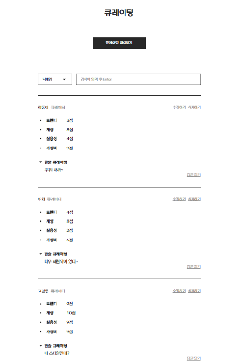
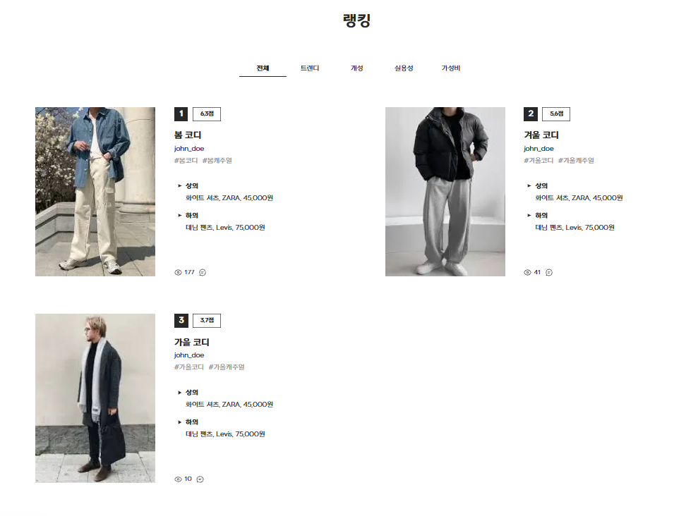
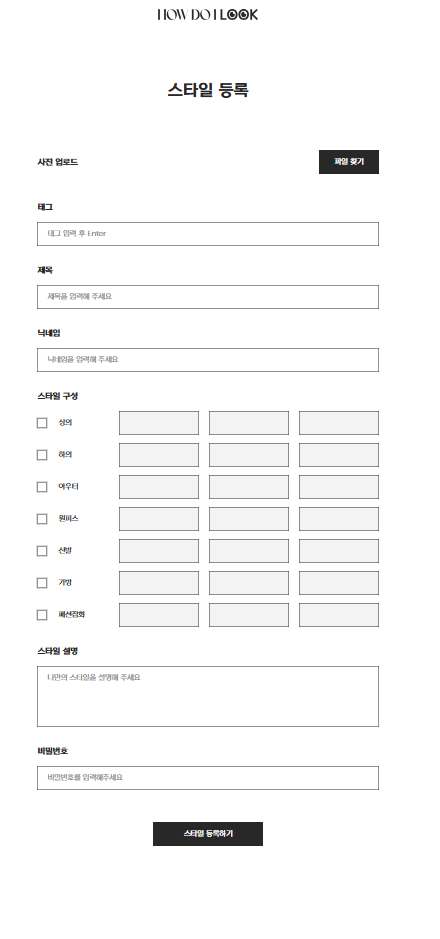
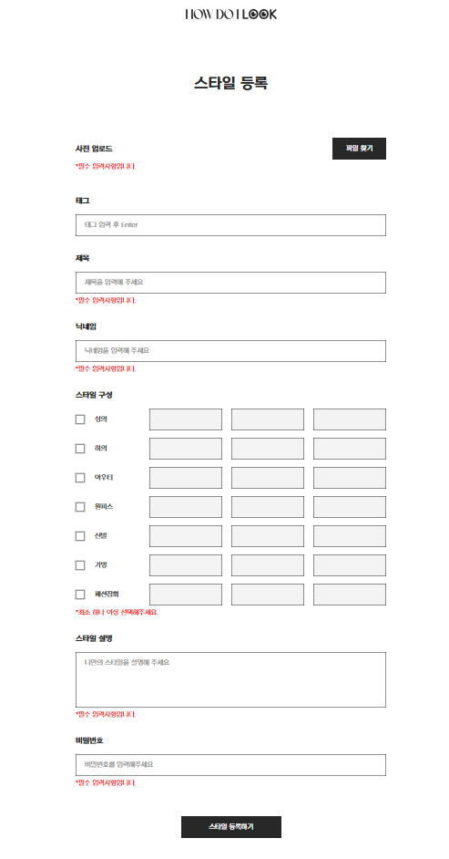
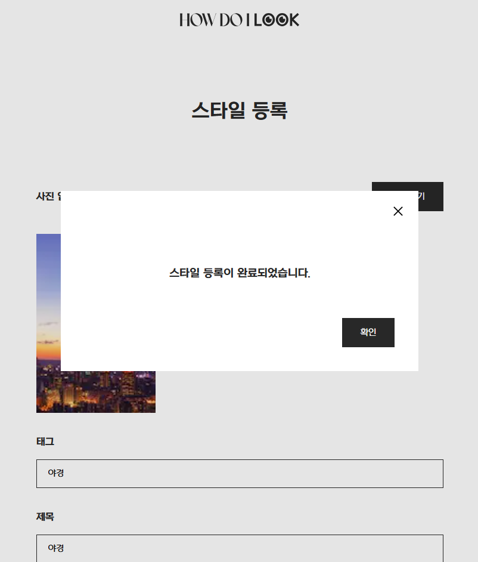
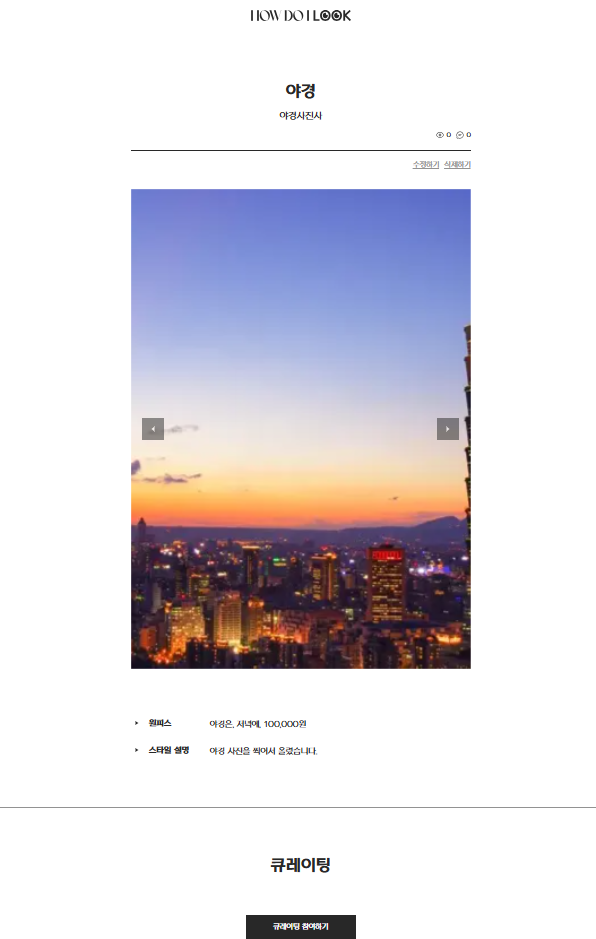
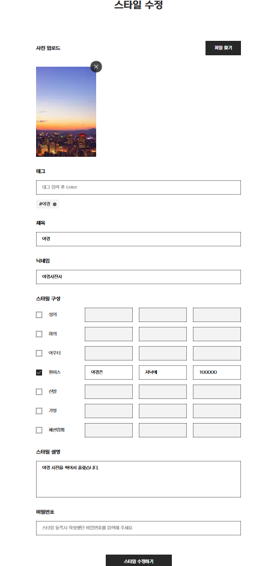
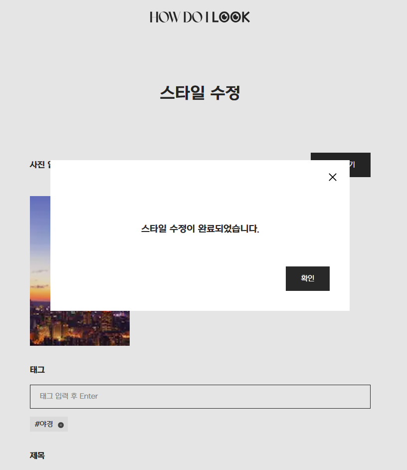
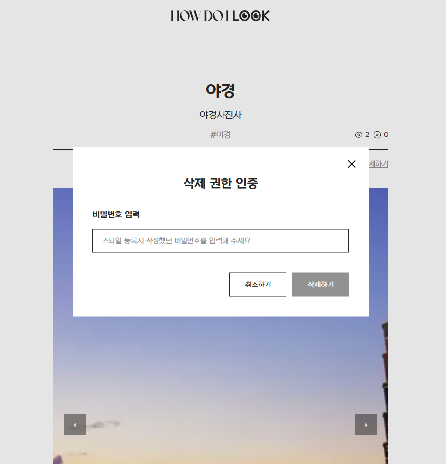
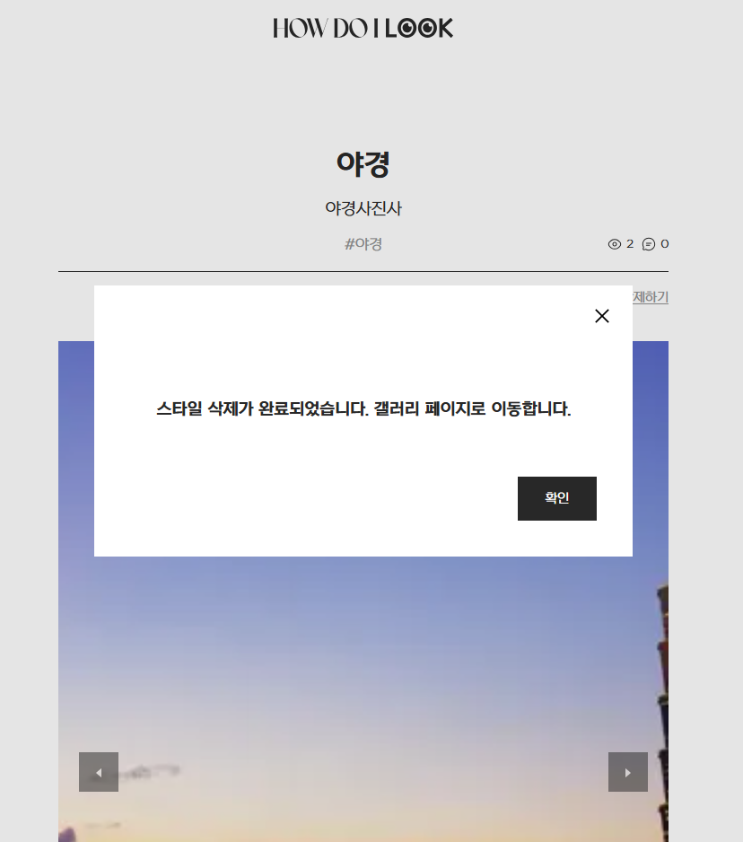

# nb05-howdoilook-team2

https://www.notion.so/NB-5-2-26fa0b8db76380fa81c0e30d66c763f3?source=copy_link

<br>

## 팀원

손훈석 (https://github.com/HS-hand)  
정인성 (https://github.com/jung-insung)  
오창섭 (https://github.com/GhostGN95)  
양승빈 (https://github.com/yangseungbin306)  
정지원 (https://github.com/XOXOXO13)

## 프로젝트 소개

- 프로그래밍 교육 사이트의 백엔드 시스템 구축 실습 프로젝트
- 프로젝트 명 : How Do I Look
- 프로젝트 기간: 2025.09.15 ~ 2025.10.02

## 기술스택

- Backend: Express.js, PrismaORM
- Database: postgreSQL
- 공통 Tool: Git & Github, Discord, Notion

## 팀원별 구현 기능 상세

### 손훈석

- comment API 구현
- tag API 구현

### 정인성

(자신이 개발한 기능에 대한 사진이나 gif 파일 첨부)

- 큐레이팅 API 구현
  - 큐레이팅 생성
    - 중복 방지 - 사용자가 같은 스타일에 한번만 큐레이팅 등록이 되게 제한 함.
    - 스타일 존재 여부 확인 - 스타일 게시글(styleId)이 존재해야 생성 가능 함.
    - 비속어/금칙어(씨x, 존나) 내용 제한 - 내용 입력 칸에 비속어/금칙어가 있으면 등록 못하게 제한 함. 
  - 큐레이팅 목록 보기
    - 스타일 존재 여부 확인 - 스타일 게시글(styleId)이 존재해야 조회 가능 함.
    - 닉네임, 한줄 큐레이팅 내용을 기준으로 검색이 가능하게 완료 함.
    - 큐레이팅에 남겨진 답글도 같이 조회되게 완료 함.
  - 큐레이팅 수정
    - 스타일 존재 여부 확인 - 스타일 게시글(styleId)이 존재해야 수정 가능 함.
    - 비밀번호 인증 - 작성자만 수정 가능 함.(비밀번호가 일치해야 수정 가능)
  - 큐레이팅 삭제
    - 스타일 존재 여부 확인 - 스타일 게시글(styleId)이 존재해야 삭제 가능 함.
    - 비밀번호 인증 - 작성자만 삭제 가능 함.(비밀번호가 일치해야 삭제 가능)

    
- 랭킹 API 구현
  - 전체, 트렌디, 개성, 실용성, 가성비 기준으로 스타일 랭킹 목록을 조회되게 함.
  - 각 스타일의 대표 이미지, 제목, 닉네임, 태그, 스타일 구성, 조회수, 큐레이팅수가 표시 됨.
  - 페이지네이션이 가능 함.

<p align="center">
  
  
</p>

### 오창섭

- style API 부분 구현
  - 생성, 상세 조회, 수정, 삭제
- 기능 사진
  - 1. 스타일 생성_기본 화면 
  - 

  - 1. 스타일 생성_빈 값 입력시
  - 

  - 1. 스타일 생성_생성 완료
  - 

  - 2. 스타일 상세 조회
  - 

  - 3. 스타일 수정_수정 (태그 추가)
  - 

  - 3. 스타일 수정_수정 완료
  - 

  - 4. 스타일 삭제_삭제 (비밀번호 입력)
  - 

  - 4. 스타일 삭제_삭제 완료
  - 


### 정지원

(자신이 개발한 기능에 대한 사진이나 gif 파일 첨부)

### 양승빈

(자신이 개발한 기능에 대한 사진이나 gif 파일 첨부)

## 파일구조

```
src
 ┣ app
 ┃ ┣ router
 ┃ ┣ ┣ base.router.js
 ┃ ┣ ┣ comment.router.js
 ┃ ┣ ┣ curation.router.js
 ┃ ┣ ┣ image.router.js
 ┃ ┣ ┣ style.router.js
 ┃ ┣ ┗ tag.router.js
 ┃ ┗ sever.js
 ┣ controller
 ┃ ┣ req.validator
 ┃ ┣ ┣ comment
 ┃ ┣ ┣ ┣ create.comment.req.validator.js
 ┃ ┣ ┣ ┣ delete.comment.req.validator.js
 ┃ ┣ ┣ ┗ update.comment.req.validator.js
 ┃ ┣ ┣ curation
 ┃ ┣ ┣ ┣ create.curation.req.validator.js
 ┃ ┣ ┣ ┣ delete.curation.req.validator.js
 ┃ ┣ ┣ ┗ update.curation.req.validator.js
 ┃ ┣ ┣ style
 ┃ ┣ ┣ ┣ create.style.req.validator.js
 ┃ ┣ ┣ ┣ delete.style.req.validator.js
 ┃ ┣ ┣ ┣ list.style.req.validator.js
 ┃ ┣ ┣ ┣ ranking.style.req.validator.js
 ┃ ┣ ┣ ┣ upload.image.req.validator.js
 ┃ ┣ ┣ ┗ update.style.req.validator.js
 ┃ ┣ ┗ base.validator.js
 ┃ ┣ res.dto
 ┃ ┣ ┣ comment
 ┃ ┣ ┣ ┣ create.comment.res.dto.js
 ┃ ┣ ┣ ┣ delete.comment.res.dto.js
 ┃ ┣ ┣ ┗ update.comment.res.dto.js
 ┃ ┣ ┣ curation
 ┃ ┣ ┣ ┣ create.curation.res.dto.js
 ┃ ┣ ┣ ┣ delete.curation.res.dto.js
 ┃ ┣ ┣ ┣ view.curation.list.res.dto.js
 ┃ ┣ ┣ ┗ update.curation.res.dto.js
 ┃ ┣ ┣ style
 ┃ ┣ ┣ ┣ create.style.res.dto.js
 ┃ ┣ ┣ ┣ delete.style.res.dto.js
 ┃ ┣ ┣ ┣ get.style.detail.res.dto.js
 ┃ ┣ ┣ ┣ list.style.res.dto.js
 ┃ ┣ ┣ ┣ ranking,style.res.dto.js
 ┃ ┣ ┣ ┗ update.style.res.dto.js
 ┃ ┣ ┣ tag
 ┃ ┣ ┗ ┗ get.tags.res.dto.js
 ┃ ┣ comment.controller.js
 ┃ ┣ style.controller.js
 ┃ ┣ curation.controller.js
 ┃ ┗ tag.controller.js
 ┣ domain
 ┃ ┣ entity
 ┃ ┣ ┣ comment.js
 ┃ ┣ ┣ style.js
 ┃ ┣ ┗ curation.js
 ┃ ┣ service
 ┃ ┣ ┣ comment.service.js
 ┃ ┣ ┣ style.service.js
 ┃ ┗ ┗ curation.service.js
 ┣ repo
 ┃ ┣ mapper
 ┃ ┣ ┣ comment.mapper.js
 ┃ ┣ ┣ style.mapper.js
 ┃ ┣ ┗ curation.mapper.js
 ┃ ┣ comment.repo.js
 ┃ ┣ style.repo.js
 ┃ ┣ tag.repo.js
 ┃ ┗ curation.repo.js
 ┣ common
 ┃ ┣ libs
 ┃ ┣ ┣ config.manager.js
 ┃ ┣ ┗ file.uploader.js
 ┃ ┣ exception.js
 ┃ ┣ config.keys.js
 ┃ ┗ vulgar.language.js
 ┣ dep-injector.js
 ┗ index.js
http
 ┣ comment-request.http
 ┣ curation-request.http
 ┗ style-request.http
prisma
 ┣ schema.prisma
 ┗ seed.js
.env
.gitignore
package.json
tsconfig.json
README.md
```

## 구현 홈페이지
https://nb05-howdoilook-team2-fe.onrender.com

## 프로젝트 회고록

(제작한 발표자료 링크 혹은 첨부파일 첨부)
